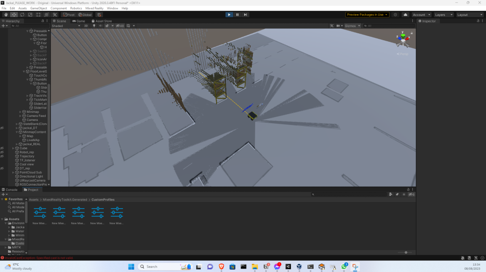

# SymbioticRobots: Mixed Reality & Digital Twin for Remote Operations
## Abstract

This project investigates the use of Mixed Reality (MR) and Digital Twin (DT) technologies to enable remote operations, inspections, and training for maintenance tasks in access-challenged or hazardous environments such as offshore wind farms or nuclear facilities. By integrating a ground robot equipped with sensors, a HoloLens device, and digital twin models, we've conceived a proof-of-concept system that facilitates the visualization and control of the robotic platform. The methodology describes a framework for deploying mixed reality applications at different levels of the Reality-Virtuality (RV) continuum. This is implemented through the fusion of Clearpath’s Jackal robot, HoloLens 2, ROS middleware, and the Unity platform. 

For a detailed overview, refer to the [dissertation document](https://github.com/oscell/SymbioticRobots/blob/main/Diss/MSc_HoloLens_Jackal_2391076.pdf).

## Overview

This project outlines the steps to building an application for the [HoloLens 2](https://learn.microsoft.com/en-us/hololens/hololens-commercial-features) that is used to interact with the DT in the ROS workspace. This is constructed using the [realsense camera](https://github.com/IntelRealSense/realsense-ros/tree/ros1-legacy) and the [clearpath jackal](https://www.clearpathrobotics.com/assets/guides/kinetic/jackal/navigation.html).

## Video
<p align="center">
  <a href="https://www.youtube.com/watch?v=wfG_v4nsM7Y">
    
  </a>
</p>

## Preview
| Unity Sceen | Development |
|:-:|:-:|
|  |  |


## Repository Contents

- **[Jackal_cam_lasers](https://github.com/oscell/Jackal_cam_lasers)**: The ROS workspace for this simulation. 

- **[Unity Package](https://github.com/oscell/SymbioticRobots/tree/main/UnityPackage)**: Contains the Unity package with all scenes and the development environment.

- **[Poster](https://github.com/oscell/SymbioticRobots/blob/main/Diss/Poster.pdf)**: A visual representation of the project.

- **[Dissertation](https://github.com/oscell/SymbioticRobots/blob/main/Diss/MSc_HoloLens_Jackal_2391076.pdf)**: The main document detailing the research, methodology, and findings.

## Setup & Installation
Unity This section explains the steps in setting up the Unity environment. Before doing this howver the [Jackal_cam_lasers](https://github.com/oscell/Jackal_cam_lasers) must be set up.

Clone:
```
git clone --recurse-submodules https://github.com/oscell/SymbioticRobots.git
```

### Requirements

To [Install Unity](https://unity.com/download) we will first install [Unity Hub](https://docs.unity3d.com/hub/manual/InstallHub.html#install-hub-linux):


We will install Unity 2020.3.2f1, although it is not explicitly mentioned, it [can work on Ubuntu 16.04](https://docs.unity3d.com/2020.1/Documentation/Manual/system-requirements.html).

Once logged into Unity Hub open `Install editor > 2020.3.48f1 LTS.`

## Setting up the project
1. Create a **New Project** using the **3D core template** unity 2020.3.48f1.
2. Switch build platform
    1. file > Build Settings
        
        [](https://github.com/oscell/SymbioticRobots/blob/main/assets/Images/buildSettings.png)
3. Use [Mixed Reality Feature Tool](https://www.microsoft.com/en-us/download/details.aspx?id=102778)
    1. Open the MixedRealityFeatureTool.exe and select he folder containing your project.

    2. Install the following:
        - Mixed Reality Toolkit Foundations
        - Mixed Reality OpenXR Plugin
    3. Go back to the project, It should prompt you to **RESTART,** this should then open **the MRTK setup** if not then ***Mixed Reality > Toolkit > Utilities > configure Project for MRTK***
    4. Select **Unity OpenXR plugin**
    5. Select **Show XR Plug-In Management Settings**
    6. Ensure that **Initialize XR on Startup** is selected, and then, under **Plugin Providers**, click **Open XR**.
        1. Select Microsoft feature group in the dropdown that appears


### Installing the Unity Robotics packages

This page provides brief instructions on installing the Unity Robotics packages. Head over to the [Pick-and-Place Tutorial](https://github.com/Unity-Technologies/Unity-Robotics-Hub/blob/main/tutorials/pick_and_place/README.md) for more detailed instructions and steps for building a sample project.

1. Create or open a Unity project.
    
    > Note: If you are adding the URDF-Importer, ensure you are using a 2020.2.0+ version of Unity Editor.
    > 
2. Open `Window` -> `Package Manager`.
3. In the Package Manager window, find and click the `+` button in the upper lefthand corner of the window. Select `Add package from git URL...`.
    
    
    
4. Enter the git URL for the desired package. Note: you can append a version tag to the end of the git url, like `#v0.4.0` or `#v0.5.0`, to declare a specific package version, or exclude the tag to get the latest from the package's `main` branch.
    1. For the [ROS-TCP-Connector](https://github.com/Unity-Technologies/ROS-TCP-Connector), enter `https://github.com/Unity-Technologies/ROS-TCP-Connector.git?path=/com.unity.robotics.ros-tcp-connector`.
    2. For the [URDF-Importer](https://github.com/Unity-Technologies/URDF-Importer), enter `https://github.com/Unity-Technologies/URDF-Importer.git?path=/com.unity.robotics.urdf-importer`.
5. Click `Add`.

### Install custom package
Assets > Import package > Custom package.

In the [UnityPackage](https://github.com/oscell/SymbioticRobots/tree/main/UnityPackage) repository the Jackal_holoLens2 and MRTK profile can be found. This should be improted into your unity project.

To install from a local clone of the repository, see [installing a local package](https://docs.unity3d.com/Manual/upm-ui-local.html) in the Unity manual.

### Build
1. Open Scene: Original:
    1. Set gizmos to 0
    2. File > Build > Add Open Scenes
    3. Build


2. Configure Visual Studio 2022 for HoloLens
    1. Select the **Master** or **Release** configuration, the **ARM64** architecture and **Remote Machine**
    2. **Project > Properties** select 
        1. **Configuration Properties > Debugging**.
        2. Click the **Debugger to launch** drop down and then select **Remote Machine**
        3. Set the IP to the Ethernet IP in **Settings>Update & Security > For developers**
3. Debug > Run without Debugging
## Launch simulation

**Terminal 1: Launch World**
```bash
source devel/setup.bash
roslaunch aws_robomaker_small_warehouse_world view_small_warehouse.launch
```
**Terminal 2: Launch Jackal**
```bash
source devel/setup.bash
roslaunch jackal_gazebo spawn_jackal.launch config:=cam_laser
```
**Terminal 3: launch SLAM**
```bash
roslaunch jackal_navigation gmapping_demo.launch
```

**Terminal 4: Rviz**
```bash
rosrun rviz rviz -d ~/Jackal_cam_lasers/rviz/holo.rviz
```

**Terminal 5: ROS TCP connection**

```bash
ifconfig
```
#### Networking

```bash
ifconfig
```

```bash
source ~/Desktop/SymbioticRobots/Jackal_ws/devel/setup.bash
roslaunch ros_tcp_endpoint endpoint.launch tcp_ip:={YOUR IP GOES HERE} tcp_port:=10000
```

## Acknowledgements

This project was developed as part of a dissertation. Special thanks to all contributors and advisors.
